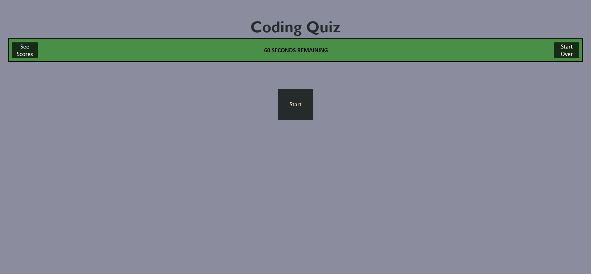
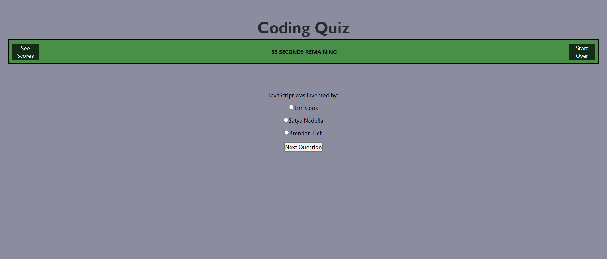
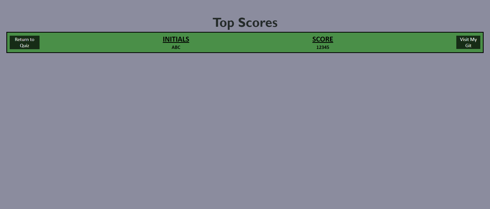

# Code Quiz
## Description
For this project, I created a quiz application. This application demonstrates my skills with JavaScript.

## Table of Contents
- [Usage](#usage)
- [User Story](#user-story)
- [Acceptance Criteria](#acceptance-criteria)
- [Credits](#credits)
- [License](#license)

## Usage
Visit my [Code Quiz here](https://quadrilateral0.github.io/Code-Quiz/). The following image shows the web application's appearance and functionality:





## User Story

```
AS A coding boot camp student
I WANT to take a timed quiz on JavaScript fundamentals that stores high scores
SO THAT I can gauge my progress compared to my peers
```

## Acceptance Criteria

```
GIVEN I am taking a code quiz
WHEN I click the start button
THEN a timer starts and I am presented with a question
WHEN I answer a question
THEN I am presented with another question
WHEN I answer a question incorrectly
THEN time is subtracted from the clock
WHEN all questions are answered or the timer reaches 0
THEN the game is over
WHEN the game is over
THEN I can save my initials and my score
```
## Credits
A thanks to my resources:
- [GoFullPage - Full Page Screen Capture Chrome Extension](https://chrome.google.com/webstore/detail/gofullpage-full-page-scre/fdpohaocaechififmbbbbbknoalclacl/related)
- [Visual Studio Code](https://code.visualstudio.com/download)

And thanks to these tutorials:
- [Using the setInterval() function in JS](https://www.youtube.com/watch?v=ubLC1JxMqfY)
- [W3 Schools](https://www.w3schools.com/)
- [MDN Web Docs](https://developer.mozilla.org/)

## License

